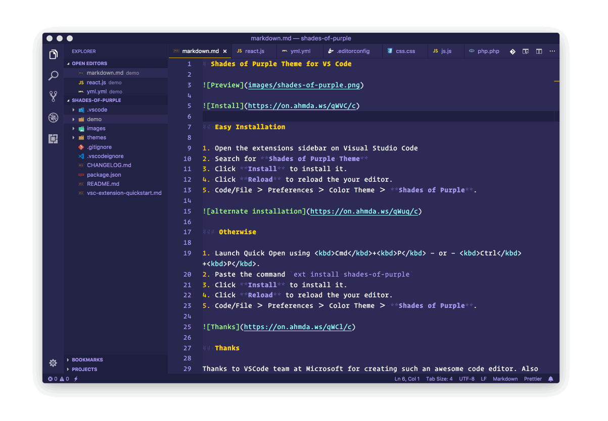

<h1 align="center">
	

	Shades of Purple Theme for VS Code
</h1>

## Easy Installation

1. Open the extensions sidebar on Visual Studio Code
2. Search for **Shades of Purple Theme**
3. Click **Install** to install it.
4. Click **Reload** to reload the your editor.
5. Code/File ＞ Preferences ＞ Color Theme ＞ **Shades of Purple**.

## Otherwise

1. Launch Quick Open using <kbd>Cmd</kbd>+<kbd>P</kbd> — or — <kbd>Ctrl</kbd>+<kbd>P</kbd>.
2. Paste the command `ext install shades-of-purple`
3. Click **Install** to install it.
4. Click **Reload** to reload the your editor.
5. Code/File ＞ Preferences ＞ Color Theme ＞ **Shades of Purple**.

## Thanks

Thanks to VSCode team at Microsoft for creating such an awesome code editor. Also to the creator of other high contrast themes that served as an inspiration.

Licensed as MIT ⓒ [Ahmad Awais](https://AhmadAwais.com/).